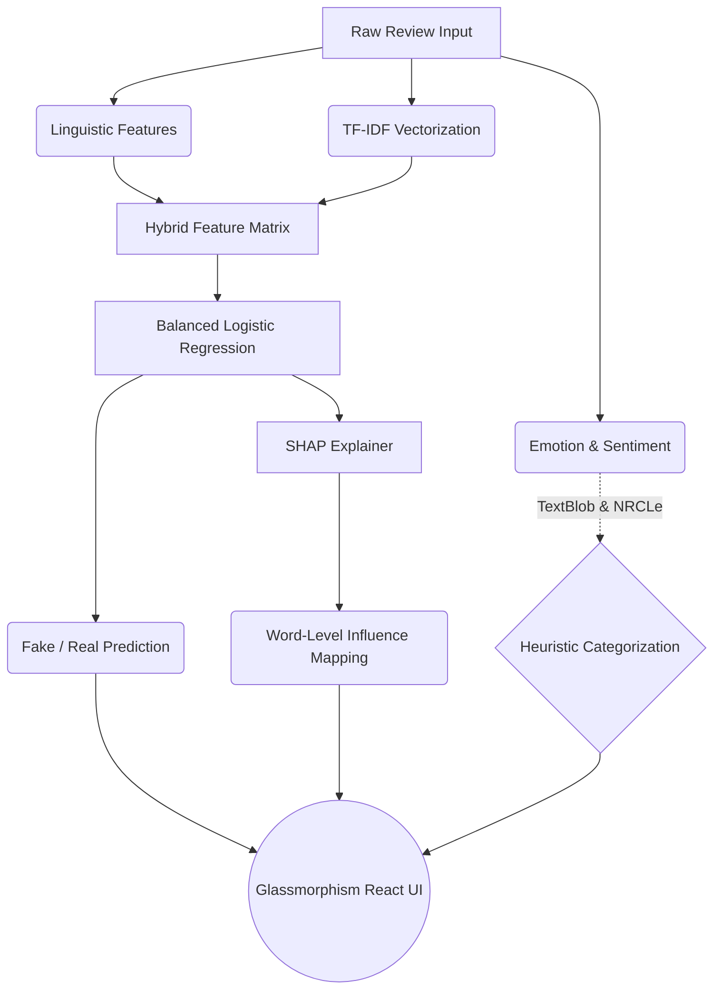

# 🔍 ReviewRefinery: Explainable Fake Review Detection Dashboard

<div align="center">
  
[](https://en.wikipedia.org/wiki/Natural_language_processing)
[](https://en.wikipedia.org/wiki/Machine_learning)
[](https://reactjs.org/)
[](https://flask.palletsprojects.com/)

*Empowering e-commerce transparency through state-of-the-art Natural Language Processing.*
</div>

---

**ReviewRefinery** is an advanced NLP and Machine Learning application designed to intelligently categorize e-commerce reviews as "Authentic" or "Deceptive" (Fake). Unlike traditional *"black-box"* prediction models, ReviewRefinery implements an **Explainable AI (XAI)** pipeline that mathematically proves *why* a review was flagged using word-level attribution, sentiment modeling, and emotional subtext.

## 🚀 The AI Architecture



## ✨ Key Capabilities

| Feature | Description | Tech Stack |
|---------|-------------|------------|
| **Explainable Tracking (SHAP)** | Visualize the exact words that pushed the model to predict "Fake" or "Real" with Red/Blue color-coding. | `shap`, `joblib` |
| **Emotion Analysis** | Dynamically detects 8 core human emotions (e.g., Joy, Anger, Trust, Anxiety) based on word-choice. | `NRCLex` |
| **Sentiment Polarity** | Classifies the underlying feeling of the review to determine if the review is overly-exaggerated. | `TextBlob` |
| **Hybrid ML Model** | Fuses traditional NLP TF-IDF frequency tracking with 12 handcrafted linguistic metrics (punctuation density, complexity, socio-linguistic cues) for pinpoint accuracy. | `scikit-learn` |
| **Real-Time API** | Highly efficient Flask pipeline that computes inference and explanations in milliseconds. | `Flask`, `Python` |

---

## 💻 Tech Stack Overview

- **Backend / API**: Python 3, Flask
- **Machine Learning**: Scikit-Learn, Pandas, NumPy
- **Natural Language Processing**: NLTK, TextBlob, NRCLex
- **Explainability**: SHAP (SHapley Additive exPlanations)
- **Frontend / Client**: React, Vite, Modern CSS3 (Grid/Flexbox/Glassmorphism)

---

## 🛠️ Installation & Setup

Ensure you have Python 3.8+ and Node.js installed before continuing.

### 1. Backend Environment

1. Navigate to the project directory:
   ```bash
   cd "NLP project"
   ```
2. Install the required Python packages:
   ```bash
   pip install -r requirements.txt
   ```
3. Initialize the Machine Learning Model (Ensure dataset is available in your `archive` folder):
   ```bash
   python train_model.py
   ```
4. Start the Flask AI Server:
   ```bash
   python app.py
   ```
   *The server will spin up on `http://127.0.0.1:5000`.*

### 2. Frontend Interface

1. Open a new terminal and navigate to the frontend:
   ```bash
   cd "NLP project/frontend"
   ```
2. Install the Node modules:
   ```bash
   npm install
   ```
3. Boot the Vite Development Server:
   ```bash
   npm run dev
   ```

*(Your browser will open automatically or provide a `localhost:5173` link to view the Dashboard!)*

---

## 📂 Repository Structure

```text
📦 Explainable-Fake-Review-Detection
 ┣ 📂 archive/              # Training datasets 
 ┣ 📂 frontend/             # Stunning React Vite UI Source Code
 ┣ 📂 models/               # Serialized .joblib pre-trained AI models
 ┣ 📜 app.py                # Main Flask API and SHAP Integration
 ┣ 📜 train_model.py        # Complete ML Training Pipeline
 ┣ 📜 features.py           # Custom Linguistic Feature Extractor
 ┣ 📜 preprocessing.py      # Data cleaning and tokenization
 ┣ 📜 requirements.txt      # Python backend dependencies
 ┗ 📜 README.md             # Project documentation
```

---

## 📝 Usage Example

Submit a review like:
> *"I bought this and it is absolutely the best product in the world!!! I won the lottery with this purchase! 100% discount buy now!"*

**ReviewRefinery Output:**
- **Prediction**: Deceptive / Fake
- **Confidence**: 89.2%
- **Emotion Found**: Exaggerated / Expectant
- **SHAP Explanation**: The words `"best"`, `"lottery"`, and `"discount"` will glow bright red, proving *why* the model isolated this as spam.

<br/>

<div align="center">
  <i>Built for the advancement of Explainable AI (XAI) in commerce.</i>
</div>
